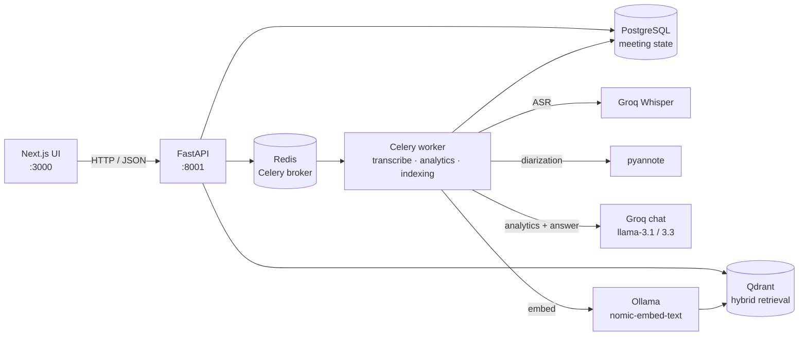
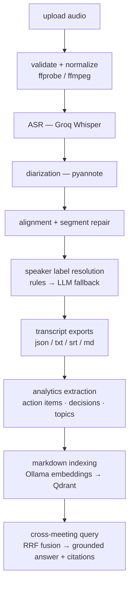
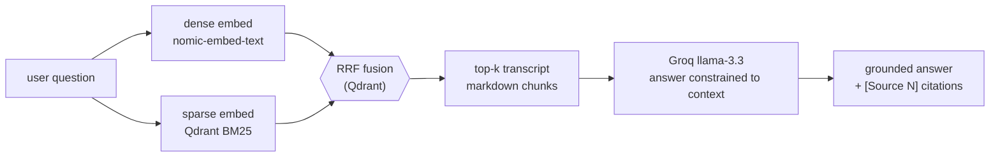

# Architecture diagrams

GitHub renders the Mermaid blocks below. To export a PNG for slides, paste the
source into <https://mermaid.live> or use the Mermaid CLI:

```bash
npx -y @mermaid-js/mermaid-cli -i assets/architecture.md -o assets/architecture.png
```

## System



## Processing pipeline



## Retrieval (cross-meeting query)


